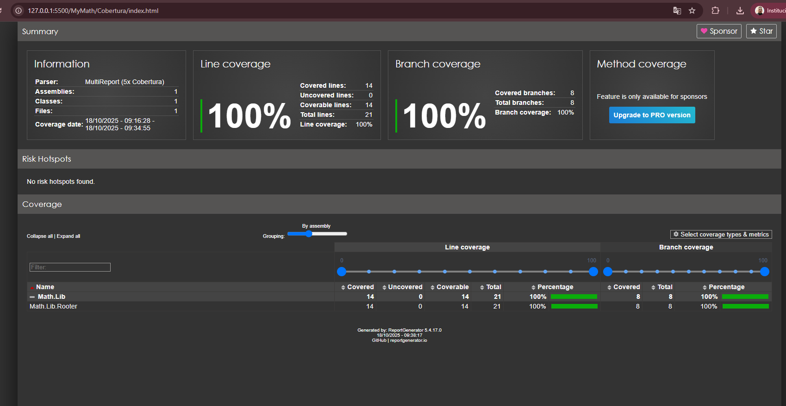
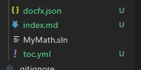
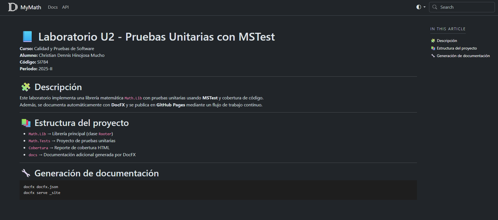
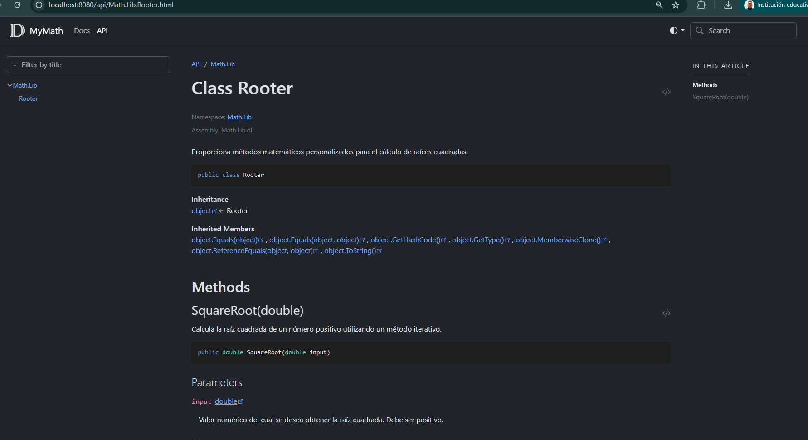
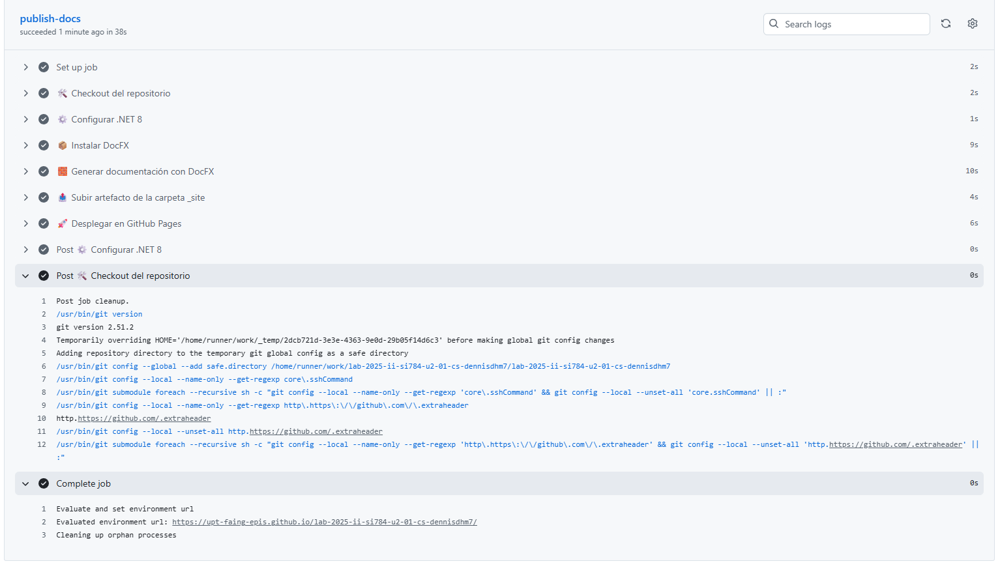

[](https://classroom.github.com/a/nqwJMwmo)
[](https://classroom.github.com/open-in-codespaces?assignment_repo_id=21152166)
# SESION DE LABORATORIO N° 01: PRUEBAS UNITARIAS CON MSTEST

## OBJETIVOS
  * Comprender el funcionamiento de las pruebas unitarias dentro de una aplicación utilizando el Framework de pruebas de Microsoft (MSTest).

## REQUERIMIENTOS
  * Conocimientos: 
    - Conocimientos básicos de Bash (powershell).
    - Conocimientos básicos de Contenedores (Docker).
  * Hardware:
    - Virtualization activada en el BIOS..
    - CPU SLAT-capable feature.
    - Al menos 4GB de RAM.
  * Software:
    - Windows 10 64bit: Pro, Enterprise o Education (1607 Anniversary Update, Build 14393 o Superior)
    - Docker Desktop 
    - Powershell versión 7.x
    - Net 6 o superior
    - Visual Studio Code

## CONSIDERACIONES INICIALES
  * Clonar el repositorio mediante git para tener los recursos necesaarios

## DESARROLLO
1. Iniciar la aplicación Powershell o Windows Terminal en modo administrador 
2. Ejecutar el siguiente comando para crear una nueva solución
```
dotnet new sln -o MyMath
```
3. Acceder a la solución creada y ejecutar el siguiente comando para crear una nueva libreria de clases y adicionarla a la solución actual.
```
cd MyMath
dotnet new classlib -o Math.Lib
dotnet sln add .\Math.Lib\Math.Lib.csproj
```
4. Ejecutar el siguiente comando para crear un nuevo proyecto de pruebas y adicionarla a la solución actual
```
dotnet new mstest -o Math.Tests
dotnet sln add .\Math.Tests\Math.Tests.csproj
dotnet add .\Math.Tests\Math.Tests.csproj reference .\Math.Lib\Math.Lib.csproj
```
5. Iniciar Visual Studio Code (VS Code) abriendo el folder de la solución como proyecto. En el proyecto Math.Lib, si existe un archivo Class1.cs proceder a eliminarlo. Asimismo en el proyecto Math.Tests si existiese un archivo UnitTest1, tambièn proceder a aliminarlo.

6. En VS Code, en el proyecto Math.Tests añadir un nuevo archivo RooterTests.cs e introducir el siguiente código:
```C#
using Microsoft.VisualStudio.TestTools.UnitTesting;

namespace Math.Tests
{
    [TestClass]
    public class RooterTests
    {
        [TestMethod]
        public void BasicRooterTest()
        {
            Rooter rooter = new Rooter();
            double expectedResult = 2.0;
            double input = expectedResult * expectedResult;
            double actualResult = rooter.SquareRoot(input);
            Assert.AreEqual(expectedResult, actualResult, delta: expectedResult / 100);
        }
    }
}
```
7. Abrir un terminal en VS Code (CTRL + Ñ) o vuelva al terminal anteriormente abierto, y ejecutar los comandos:
```
dotnet restore
dotnet test --collect:"XPlat Code Coverage"
```
8. El paso anterior debe producir un error por lo que sera necesario escribir el código mecesario para que el test funcione. 
9. En el proyecto Math.Lib, añadir un nuevo archivo Rooter.cs, con el siguiente contenido:
```C#
namespace Math.Lib
{
    public class Rooter
    {
        public double SquareRoot(double input)
        {
            return input / 2;
        }
    }
}
```
10. Seguidamente modificar el archivo RooterTests.cs y adicionar al inicio del mismo el siguiente contenido:
```C#
using Math.Lib;
```
11. Ejecutar nuevamente el pase 6 y ahora deberia devolver algo similar a lo siguiente:
```
Correctas! - Con error:     0, Superado:     2, Omitido:     0, Total:     2, Duración: 12 ms - Math.Tests.dll
```
12. Con la finalidad de aumentar la confienza en la aplicación, se ampliará el rango de pruebas para lo cual editar la clase de prueba RooterTests y adicionar los métodos siguientes:
```C#
        [TestMethod]
        public void RooterValueRange()
        {
            Rooter rooter = new Rooter();
            for (double expected = 1e-8; expected < 1e+8; expected *= 3.2)
                RooterOneValue(rooter, expected);
        }
        private void RooterOneValue(Rooter rooter, double expectedResult)
        {
            double input = expectedResult * expectedResult;
            double actualResult = rooter.SquareRoot(input);
            Assert.AreEqual(expectedResult, actualResult, delta: expectedResult / 1000);
        }
```
13. Ejecutar nuevamente el paso 6 para lo cual se obtendra un error similar al siguiente:
```
Con error! - Con error:     1, Superado:     2, Omitido:     0, Total:     3, Duracin: 30 ms - Math.Tests.dll
```
14. A fin de que las pruebas puedan ejecutarse correctamente, modificar la clase Rooter de la siguiente manera:
```C#
namespace Math.Lib
{
    public class Rooter
    {
        public double SquareRoot(double input)
        {
            double result = input;
            double previousResult = -input;
            while (System.Math.Abs(previousResult - result)
                > result / 1000)
            {
            previousResult = result;
            result = result - (result * result - input) / (2 * result);
            }
            return result;
        }
    }
}
```
15. Volver a ejecutar el paso 6 y verificar el resultado, debería ser similar a lo siguiente
```
Correctas! - Con error:     0, Superado:     3, Omitido:     0, Total:     3, Duracin: 14 ms - Math.Tests.dll
```
16. Adicionar un nuevo caso de prueba con excepción en la clase RooterTests:
```C#
        [TestMethod]
        public void RooterTestNegativeInputx()
        {
            Rooter rooter = new Rooter();
            try
            {
                rooter.SquareRoot(-10);
            }
            catch (System.ArgumentOutOfRangeException)
            {
                return;
            }
            Assert.Fail();
        }
```
17. Modificar la clase Rooter adicionando una nueva condición:
```C#
namespace Math.Lib
{
    public class Rooter
    {
        public double SquareRoot(double input)
        {
            if (input <= 0.0) throw new ArgumentOutOfRangeException();
            double result = input;
            double previousResult = -input;
            while (System.Math.Abs(previousResult - result)
                > result / 1000)
            {
            previousResult = result;
            result = result - (result * result - input) / (2 * result);
            }
            return result;
        }
    }
}
```
18. Al ejecutar las pruebas (paso 6) se obtendrá el siguiente resultado:
```
Correctas! - Con error:     0, Superado:     4, Omitido:     0, Total:     4, Duración: 13 ms - Math.Tests.dll
```
19. Finalmente proceder a verificar la cobertura, dentro del proyecto Primes.Tests se dede haber generado una carpeta o directorio TestResults, en el cual posiblemente exista otra subpcarpeta o subdirectorio conteniendo un archivo con nombre `coverage.cobertura.xml`, si existe ese archivo proceder a ejecutar los siguientes comandos desde la linea de comandos abierta anteriomente, de los contrario revisar el paso 8:
```
dotnet tool install -g dotnet-reportgenerator-globaltool
ReportGenerator "-reports:./*/*/*/coverage.cobertura.xml" "-targetdir:Cobertura" -reporttypes:HTML
```
20. El comando anterior primero proceda instalar una herramienta llamada ReportGenerator (https://reportgenerator.io/) la cual mediante la segunda parte del comando permitira generar un reporte en formato HTML con la cobertura obtenida de la ejecución de las pruebas. Este reporte debe localizarse dentro de una carpeta llamada Cobertura y puede acceder a el abriendo con un navegador de internet el archivo index.htm.

---
## Actividades Encargadas
1. Adicionar un nuevo escenario de prueba donde se maneje una excepción con un mensaje que diga "El valor ingresado es invalido, solo se puede ingresar números positivos".

    * Modificamos `Rooter.cs` para que lance una excepción con el mensaje solicitado
        ```c#
        namespace Math.Lib
        {
            public class Rooter
            {
                public double SquareRoot(double input)
                {
                    if (input <= 0.0)
                        throw new ArgumentOutOfRangeException(nameof(input),
                            "El valor ingresado es invalido, solo se puede ingresar números positivos");

                    double result = input;
                    double previousResult = -input;
                    while (System.Math.Abs(previousResult - result) > result / 1000)
                    {
                        previousResult = result;
                        result = result - (result * result - input) / (2 * result);
                    }
                    return result;
                }
            }
        }
        ```

    * Agregamos un nuevo metodo a la clase `RooterTest.cs` 
        ```c#
        [TestMethod]
        public void RooterInvalidInputMessage()
        {
            Rooter rooter = new Rooter();

            try
            {
                rooter.SquareRoot(-5);
                Assert.Fail("Se esperaba una excepción ArgumentOutOfRangeException, pero no fue lanzada.");
            }
            catch (ArgumentOutOfRangeException ex)
            {
                StringAssert.Contains(ex.Message, "El valor ingresado es invalido, solo se puede ingresar números positivos");
            }
        }
        ```
    * Ejecutamos el comando
        ```
        dotnet test --collect:"XPlat Code Coverage"
        ReportGenerator "-reports:./*/*/*/coverage.cobertura.xml" "-targetdir:Cobertura" -reporttypes:HTML
        ```
    * Verificamos la cobertura generada

        


2. Completar la documentación del Clases, atributos y métodos para luego generar una automatización (publish_docs.yml) que genere la documentación utilizando DocFx y la publique en una Github Page

    * Editamos nuestro archivo `MyMath\Math.Lib\Rooter.cs` con:
        ```c#
        namespace Math.Lib
        {
            /// <summary>
            /// Proporciona métodos matemáticos personalizados para el cálculo de raíces cuadradas.
            /// </summary>
            public class Rooter
            {
                /// <summary>
                /// Calcula la raíz cuadrada de un número positivo utilizando un método iterativo.
                /// </summary>
                /// <param name="input">Valor numérico del cual se desea obtener la raíz cuadrada. Debe ser positivo.</param>
                /// <returns>La raíz cuadrada del número especificado.</returns>
                /// <exception cref="ArgumentOutOfRangeException">
                /// Se lanza cuando el valor de <paramref name="input"/> es menor o igual a cero.
                /// </exception>
                public double SquareRoot(double input)
                {
                    if (input <= 0.0)
                        throw new ArgumentOutOfRangeException(nameof(input),
                            "El valor ingresado es invalido, solo se puede ingresar números positivos");

                    double result = input;
                    double previousResult = -input;
                    while (System.Math.Abs(previousResult - result) > result / 1000)
                    {
                        previousResult = result;
                        result = result - (result * result - input) / (2 * result);
                    }
                    return result;
                }
            }
        }
        ```
    * Instalamos en `MyMath/`:
        ```
        dotnet new tool-manifest
        dotnet tool install docfx
        ```
    * Creamos la estructura base:
        ```
        docfx init
        ```
        

    * Generamos la documentación con:
        ```
        docfx docfx.json
        ```
    * Visualizamos localmente con:
        ```
        docfx serve _site
        ```
    * Configuramos el `index.md`
        ```
        # 📘 Laboratorio U2 - Pruebas Unitarias con MSTest

        **Curso:** Calidad y Pruebas de Software  
        **Alumno:** Christian Dennis Hinojosa Mucho  
        **Código:** SI784  
        **Periodo:** 2025-II  

        ---

        ## 🧩 Descripción
        Este laboratorio implementa una librería matemática `Math.Lib` con pruebas unitarias usando **MSTest** y cobertura de código.  
        Además, se documenta automáticamente con **DocFX** y se publica en **GitHub Pages** mediante un flujo de trabajo continuo.

        ---

        ## 📚 Estructura del proyecto
        - `Math.Lib` → Librería principal (clase `Rooter`)
        - `Math.Tests` → Proyecto de pruebas unitarias
        - `Cobertura` → Reporte de cobertura HTML
        - `docs` → Documentación adicional generada por DocFX

        ---

        ## 🔧 Generación de documentación
        ```bash
        docfx docfx.json
        docfx serve _site

        ```
    * Editamos `docfx.json`
        ```
        {
        "$schema": "https://raw.githubusercontent.com/dotnet/docfx/main/schemas/docfx.schema.json",
        "metadata": [
            {
            "src": [
                {
                "src": "Math.Lib",
                "files": [
                    "**/*.csproj"
                ]
                }
            ],
            "dest": "api"
            }
        ],
        "build": {
            "content": [
            {
                "files": [
                "**/*.{md,yml}"
                ],
                "exclude": [
                "_site/**",
                "obj/**",
                "bin/**"
                ]
            }
            ],
            "resource": [
            {
                "files": [
                "images/**",
                "assets/**"
                ]
            }
            ],
            "output": "_site",
            "template": [
            "default",
            "modern"
            ],
            "globalMetadata": {
            "_appName": "MyMath",
            "_appTitle": "Laboratorio U2 - Pruebas Unitarias con MSTest",
            "_enableSearch": true,
            "_disableContribution": true
            }
        }
        }

        ```
    * Generamos la documentacion con:
        ```
        docfx docfx.json
        ```
    
    
    

    * Para la automatizacion de la creamos el archivo `.github/workflows/publish_docs.yml`
        ```yml
        name: 📘 Publicar documentación con DocFX

        on:
        push:
            branches: [ main ]

        permissions:
        contents: read
        pages: write
        id-token: write

        concurrency:
        group: "pages"
        cancel-in-progress: false

        jobs:
        publish-docs:
            environment:
            name: github-pages
            url: ${{ steps.deployment.outputs.page_url }}
            runs-on: ubuntu-latest

            steps:
            - name: 🛠️ Checkout del repositorio
                uses: actions/checkout@v4

            - name: ⚙️ Configurar .NET 8
                uses: actions/setup-dotnet@v4
                with:
                dotnet-version: '8.0.x'

            - name: 📦 Instalar DocFX
                run: dotnet tool update -g docfx

            - name: 🧱 Generar documentación con DocFX
                run: docfx MyMath/docfx.json

            - name: 📤 Subir artefacto de la carpeta _site
                uses: actions/upload-pages-artifact@v3
                with:
                path: 'MyMath/_site'

            - name: 🚀 Desplegar en GitHub Pages
                id: deployment
                uses: actions/deploy-pages@v4
        ``` 
    

3. Generar una automatización (publish_cov_report.yml) que: * Compile el proyecto y ejecute las pruebas unitarias, * Genere el reporte de cobertura, * Publique el reporte en Github Page
    * Creamos el archivo `publish_cov_report.yml`
        ```
        name: 🧪 Publicar reporte de cobertura

        on:
        push:
            branches: [ main ]
        pull_request:

        permissions:
        contents: write
        pages: write
        id-token: write

        jobs:
        build-test-and-report:
            runs-on: ubuntu-latest

            steps:
            - name: 🛠️ Checkout del repositorio
                uses: actions/checkout@v4

            - name: ⚙️ Configurar .NET 8
                uses: actions/setup-dotnet@v4
                with:
                dotnet-version: '8.0.x'

            - name: 🧩 Restaurar dependencias
                run: dotnet restore MyMath/MyMath.sln

            - name: 🧱 Compilar solución
                run: dotnet build MyMath/MyMath.sln --no-restore --configuration Release

            - name: 🧪 Ejecutar pruebas con cobertura
                run: dotnet test MyMath/Math.Tests/Math.Tests.csproj --collect:"XPlat Code Coverage" --results-directory MyMath/TestResults --logger "trx"

            - name: 📊 Instalar ReportGenerator
                run: dotnet tool install -g dotnet-reportgenerator-globaltool

            - name: 🧮 Generar reporte HTML
                run: ReportGenerator "-reports:MyMath/TestResults/*/coverage.cobertura.xml" "-targetdir:MyMath/Cobertura" -reporttypes:Html

            - name: 📤 Publicar reporte en GitHub Pages
                uses: peaceiris/actions-gh-pages@v3
                with:
                github_token: ${{ secrets.GITHUB_TOKEN }}
                publish_dir: MyMath/Cobertura

        ```
    * Fusionamos las 2 publicaicones en una para poder ver los reportes de la documentancion del proyecto y la cobertura en un solo archivo yml `publish_all.yml`
        ```
        name: 🚀 Publicar documentación y reporte de cobertura

        on:
        push:
            branches: [ main ]
        pull_request:

        permissions:
        contents: read
        pages: write
        id-token: write

        concurrency:
        group: "publish-all"
        cancel-in-progress: false

        jobs:
        build-test-docs:
            runs-on: ubuntu-latest

            steps:
            - name: 🛠️ Checkout del repositorio
                uses: actions/checkout@v4

            - name: ⚙️ Configurar .NET 8
                uses: actions/setup-dotnet@v4
                with:
                dotnet-version: '8.0.x'

            # ==============================
            # 🧪 TESTS Y COBERTURA
            # ==============================
            - name: 🧩 Restaurar dependencias
                run: dotnet restore MyMath/MyMath.sln

            - name: 🧱 Compilar solución
                run: dotnet build MyMath/MyMath.sln --no-restore --configuration Release

            - name: 🧪 Ejecutar pruebas con cobertura
                run: dotnet test MyMath/Math.Tests/Math.Tests.csproj --collect:"XPlat Code Coverage" --results-directory MyMath/TestResults --logger "trx"

            - name: 📊 Instalar ReportGenerator
                run: |
                dotnet tool install -g dotnet-reportgenerator-globaltool
                export PATH="$PATH:/home/runner/.dotnet/tools"

            - name: 🧮 Generar reporte HTML de cobertura
                run: reportgenerator "-reports:MyMath/TestResults/*/coverage.cobertura.xml" "-targetdir:MyMath/Cobertura" -reporttypes:Html

            # ==============================
            # 📘 GENERACIÓN DE DOCFX
            # ==============================
            - name: 📦 Instalar DocFX
                run: dotnet tool update -g docfx

            - name: 🧱 Generar documentación con DocFX
                run: docfx MyMath/docfx.json

            # ==============================
            # 📂 COMBINAR DOCFX + COBERTURA
            # ==============================
            - name: 🧩 Mover reporte de cobertura dentro del sitio DocFX
                run: |
                mkdir -p MyMath/_site/coverage
                cp -r MyMath/Cobertura/* MyMath/_site/coverage/

            # ==============================
            # 📤 PUBLICAR EN GITHUB PAGES
            # ==============================
            - name: 📤 Subir artefacto completo para GitHub Pages
                uses: actions/upload-pages-artifact@v3
                with:
                path: MyMath/_site

        deploy:
            environment:
            name: github-pages
            url: ${{ steps.deployment.outputs.page_url }}
            runs-on: ubuntu-latest
            needs: build-test-docs
            steps:
            - name: 🚀 Desplegar en GitHub Pages
                id: deployment
                uses: actions/deploy-pages@v4

        ```

    * Con este ultimo se desplegara en `https://upt-faing-epis.github.io/lab-2025-ii-si784-u2-01-cs-dennisdhm7/` y en `https://upt-faing-epis.github.io/lab-2025-ii-si784-u2-01-cs-dennisdhm7/coverage/`
    

4. Generar una automatización (release.yml) que: * Genere el nuget con su codigo de matricula como version del componente, * Publique el nuget en Github Packages, * Genere el release correspondiente

    * Creamos el archivo `release.yml`
        ```
        name: 🚀 Generar y publicar NuGet + Release

        on:
        workflow_dispatch:
        push:
            tags:
            - 'v*'   # se ejecuta cuando subas un tag como "v1.0.0-SI784"

        permissions:
        contents: write
        packages: write

        jobs:
        build-and-publish:
            runs-on: ubuntu-latest

            steps:
            - name: 🛠️ Checkout del repositorio
                uses: actions/checkout@v4

            - name: ⚙️ Configurar .NET 8
                uses: actions/setup-dotnet@v4
                with:
                dotnet-version: '8.0.x'

            - name: 🧩 Restaurar dependencias
                run: dotnet restore MyMath/MyMath.sln

            - name: 🧱 Compilar solución
                run: dotnet build MyMath/MyMath.sln --configuration Release --no-restore

            # 🧮 Empaquetar la librería como .nupkg con tu código de matrícula
            - name: 📦 Generar paquete NuGet
                run: dotnet pack MyMath/Math.Lib/Math.Lib.csproj --configuration Release -p:PackageVersion=1.0.0-SI784 -o ./nupkg

            # 🚀 Publicar paquete en GitHub Packages
            - name: 🚀 Publicar en GitHub Packages
                run: dotnet nuget push "./nupkg/*.nupkg" --source "https://nuget.pkg.github.com/${{ github.repository_owner }}/index.json" --api-key ${{ secrets.GITHUB_TOKEN }}

            # 🏷️ Crear Release en GitHub
            - name: 🏷️ Crear Release con artefacto NuGet
                uses: softprops/action-gh-release@v1
                with:
                files: ./nupkg/*.nupkg
                tag_name: v1.0.0-SI784
                name: "Release v1.0.0-SI784"
                body: |
                    🚀 **Release generado automáticamente**
                    - 📦 Paquete: Math.Lib
                    - 🧑 Alumno: Christian Dennis Hinojosa Mucho
                    - 🧾 Versión: 1.0.0-SI784

        ```

    * Modificamos las propiedades de `MyMath/Math.Lib/Math.Lib.csproj`
        ```
        <GeneratePackageOnBuild>false</GeneratePackageOnBuild>
        <Authors>Christian Dennis Hinojosa Mucho</Authors>
        <Company>UPT-FAING-EPIS</Company>
        <RepositoryUrl>https://github.com/UPT-FAING-EPIS/lab-2025-ii-si784-u2-01-cs-dennisdhm7</RepositoryUrl>
        <PackageId>Math.Lib</PackageId>
        <Version>1.0.0-SI784</Version>
        <Description>
        Laboratorio de Calidad y Pruebas de Software - UPT-FAING-EPIS
        - 🧑 Alumno: Christian Dennis Hinojosa Mucho
        </Description>
        <PackageLicenseExpression>MIT</PackageLicenseExpression>
        <PackageProjectUrl>https://upt-faing-epis.github.io/lab-2025-ii-si784-u2-01-cs-dennisdhm7/</PackageProjectUrl>
        ```